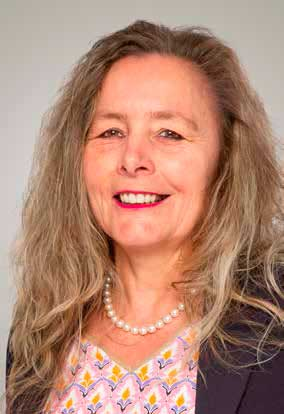
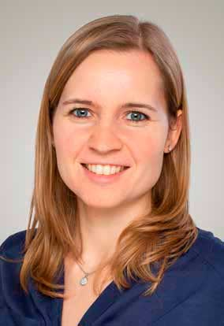
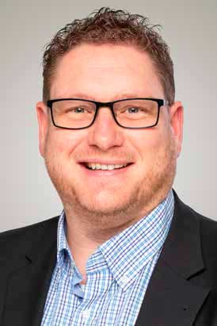
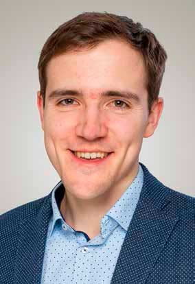

\page Kandidaten_8md Kandidaten 👥

\tableofcontents

Auf dieser Seite stellen sich unsere Kandidatinnen und
Kandidaten für den Gemeinderat vor.

## Gert Becker

- 36 Jahre
- selbstständiger Anwalt und Jurist bei der DGB Rechtsschutz GmbH
- ledig

Liebe Hochdorferinnen und Hochdorfer,

ich bin Gert Becker und lebe seit meiner Geburt vor 36 Jahren in Hochdorf.

Aufgrund meiner beruflichen Tätigkeit als Rechtsanwalt und Gewerkschaftsjurist bin
ich regelmäßig mit vielschichtigen und komplexen Sachverhalten konfrontiert, die
neben der Wahrung und Durchsetzung des eigenen Standpunktes ein gesundes Maß
an Kompromissbereitschaft erfordern.

Die dabei gewonnene Erfahrung möchte ich gerne in den Gemeinrat einbringen und
mich Ihrer Interessen, liebe Hochdorferinnen und Hochdorfer, annehmen. Mir ist es
wichtig, dass sich der Gemeinderat um Ihre Bedürfnisse kümmert. Mit Ihrer Stimme für
mich geben Sie mir die Möglichkeit, im Gemeinderat bürgernah und vorausschauend zu
agieren.

Neben meiner beruflichen Tätigkeit interessiere ich mich v.a. für Literatur, Städtereisen,
Standard- und Lateintänze, Theater, Oper und Kunst.

Ihr Gert Becker

## Marc Behringer

- 25 Jahre
- Student (Gymnasiales Lehramt, Chemie und Geschichte)
- ledig

Mit meiner Kandidatur für den Hochdorfer Gemeinderat möchte ich jugendlichen und
frischen Wind in die Gemeindepolitik bringen!

Meine besonderen Anliegen sind hierbei: das generationsübergreifende, dörfliche Zusammenleben
in der Gemeinde, Stärkung des Ehrenamtes und des Vereinslebens, sowie
Bildung und Kinderbetreuung. Ebenfalls sind mir Themen wie Umweltbewusstsein, Natur
erlebbar machen und Nachhaltigkeit wichtig. Motivation für die Tätigkeit im Gemeinderat
nehme ich aus den Erfahrungen als 1. Vorsitzender der Jungen Union Neckar-Fils und
aus meiner Zeit als Beisitzer im Kreisvorstand der Jungen Union Esslingen sowie aus
meinen anderen ehrenamtlichen Tätigkeiten.

Ich übernehme gerne Verantwortung und setze mich für meine Mitmenschen ein,
deshalb bin ich in der Feuerwehr Hochdorf, dort auch in der Jugendfeuerwehr als Jugendwart,
als Standortleiter der Helfer vor Ort Gruppe Hochdorf und in verschiedenen Führungspositionen
im Deutschen Roten Kreuz ehrenamtlich aktiv. Für meine ehrenamtliche
Tätigkeiten erhielt ich den Ehrenamtspreis 2018, diese Auszeichung gibt mir für mein
weiteres ehrenamtliches Engagement, auch in Bezug auf die Tätigkeit als Gemeinderat,
Motivation.

## Dieter Bek

- 64 Jahre
- Gemeinderat seit 2015
- Erster Vorsitzender des Kleintierzüchterverein Hochdorf, Mitglied in der Vorstandschaft der AGHV
- verheiratet, 1 Tochter

Ich bin in Hochdorf geboren und fühle mich mit meiner Familie bis heute sehr wohl.
Deshalb habe ich mich auch seit vielen Jahren in verschiedenen Vereinen sowie in der
Kommunalpolitik engagiert.

Die Bürgerschaft muss mitbestimmen. Die Verwaltung muss für die Bürgerschaft da sein.
Solide Finanzen sind mit die wichtigste Grundlage um Hochdorf attraktiver und moderner
gestalten zu können. Ehrenamtliche Tätigkeiten sind ein sehr wichtiger Bestandteil
in vielen Bereichen Hochdorfs. Um die vielen Aufgaben bewältigen zu können, bedarf es
einer guter Unterstützung und Zusammenarbeit.

Hierfür möchte ich mich mit meiner Erfahrung als Gemeinderat einsetzen und auch in
Zukunft Verantwortung übernehmen.

## Regina Bönisch

- 53 Jahre
- Rektorin
- verheiratet, 1 Sohn

Meine persönlichen Erfahrungen aus Beruf, Ehrenamt und früherer Gemeinderatstätigkeit
möchte ich zukünftig in die Arbeit des Gemeinderates einbringen.

Ich möchte die Interessen der Bürgerinnen und Bürger aller Altersgruppen vertreten.
Es ist mir wichtig, bisher Erreichtes zu bewahren und Anstehendes zeitgemäß weiterzuentwickeln.
Die aktuellen gesellschaftlichen Veränderungen gilt es im Blick zu behalten,
um zukunftsorientierte Entscheidungen zu treffen.

Wichtige Punkte in der Gemeindepolitik sind für mich im Besonderen: dörfliche Strukturen
erhalten und stärken, Nachhaltigkeit und Naturbewusstsein, erschwinglichen
Wohnraum für jüngere Generationen, gute Versorgung für Ältere, Begegnungsstätten
und generationsübergreifende Projekte.

Auf Grund meiner persönlichen Erfahrungen als Schulleiterin liegen mir die Themen
„Bildung“ und „Kinderbetreuung“ besonders am Herzen. Mir ist es als gebürtige Hochdorferin
ein Anliegen, mich für meine Gemeinde einzusetzen und Verantwortung zu
übernehmen. Meine Erfahrungen aus Beruf, Familie, Ehrenamt und Freizeit bilden aus
meiner Sicht eine gute Grundlage für eine zukunftsorientierte Gemeinderatsarbeit.

## Francie Briemle

- 32 Jahre
- Lehrerin
- verheiratet, 1 Tochter

Im Interesse der vielen jungen Familien in Hochdorf möchte ich mich aktiv, konstruktiv
und effektiv um die aktuellen Anliegen der Bürgerinnen und Bürger sowie der Gemeinde
kümmern und zielorientiert zur Umsetzung notwendiger Veränderungen beitragen.

Besonders wichtig sind mir dabei die Gestaltung der Kleinkind- und Schulkindbetreuung
sowie die Verkehrssicherheit im unmittelbaren Straßen- und Radwegenetz rund um
Hochdorf.

Die Bedürfnisse unserer Kinder und Jugendlichen und deren Eltern sind mir dabei
berufsbedingt bekannt und liegen mir sehr am Herzen. Hochdorf weiterhin lebens- und
liebenswert zu gestalten soll im Zentrum meiner Arbeit stehen.

## Rolf Dreher

- 57 Jahre
- Werkzeugmacher, Berufskraftfahrer im LKW Versuch/Transportlogistik
- ledig

Aus Esslingen stammend wohne ich seit 2005 mit meiner Lebensgefährtin in Hochdorf.

Ehrenamtlich engagiere ich mich als 1. Vorsitzender der Arbeitsgemeinschaft Hochdorfer
Vereine.

Durch diese Aufgabe habe ich einen guten Einblick in das vielseitige Hochdorfer
Vereins-leben und die Jugendarbeit die dort geleistet wird.

Ebenso liegen mir die Lebens- und Wohnqualität sowie eine gute Infrastruktur in
unserer Gemeinde sehr am Herzen.

Hierzu zählen für mich eine erstklassige medizinische und pflegerische Versorgung
unserer Bevölkerung, familienfreundliche und flexible Ganztagsangebote für unsere
Kinder und deren Familien, Ausbau der Digitalen Infrastruktur, um nur einige Beispiele
zu nennen. Selbstverständlich möchte ich mich für alle anderen wichtigen Themen ebenfalls
mit aller Kraft engagieren.

Für diese zukunftsorientierten Themen möchte ich mich einsetzen und bitte Sie für die
kommende Gemeinderatswahl um Ihre Stimme.

## Markus Krämer

- 44 Jahre
- staatl. geprüfter Elektrotechniker
- Teamleiter Service, zuständig für Baden-Württemberg
- geschieden, 2 Kinder

Seit meiner Geburt lebe ich in Hochdorf und fühle mich sehr wohl „em Flecka“. Neben
meinen beruflichen Erfahrungen ein Team zu führen, möchte ich auch meine organisatorischen
Fähigkeiten aus über 30 Jahren Vereinsleben mit einbringen. Diese sind
generationenübergreifend und sehr wertvoll für mich.

Mein Engagement als Mitglied in einigen örtlichen Vereinen zeigt, was Ehrenamt für
mich bedeutet und wie ich zu meinem Ort stehe. Höhepunkte daraus waren für mich
neun Jahre Jugendleiter im Musikverein mit über 130 Jugendlichen unter 18 Jahren und
die Mitorganisation des 100jährigen Jubiläums. Ebenso die Mitwirkung im Organisationsteam
der AGHV an zwei Dorffesten (das dritte läuft bereits). Aber nicht nur die
Belange der Vereine sind mir wichtig, sondern die aller Hochdorfer Bürgerinnen und
Bürger. Transparenz der Gremienarbeit verhindert Unmut und bringt Verständnis. Als
Vater zweier Kinder (5 und 9 Jahre) sind mir auch unsere Jugendlichen wichtig. Sie sind
unsere Zukunft und wir müssen jetzt die richtigen Weichen stellen.

In den Jahren als Elternbeirat konnte ich viele Einblicke in die Kindergärten Hochdorfs
bekommen. Gerne würde ich mich für Ihr Wohl im Gemeinderat engagieren und
einsetzen. Packen wir es an. Geben Sie uns Ihre Stimmen am 26. Mai 2019.

## Rudolf Krämer

- 67 Jahre
- Polizeibeamter i.R.
- verheiratet, 1 Sohn

Gemeinderat und Kandidat für die Wahl zum Kreistag.

Als Mitglied in verschiedenen, örtlichen Vereinen und Vorstand der Wanderfreunde
Hochdorfer Schnaken e.V. liegt mir, unter anderem, die Jugend- und Vereinsarbeit sehr
am Herzen!

Ohne ehrenamtliches Engagement wären viele Aufgaben nicht oder nur mit erheblichem
finanziellem Aufwand zu bewältigen, weshalb die Unterstützung und Förderung des
Ehrenamtes in unserer Gesellschaft immer wichtiger wird.

Gerne würde ich für eine weitere Amtszeit meine langjährige Erfahrung im Gemeinderat
zum Wohle der Gemeinde einbringen.

## Timo Unger

- 26 Jahre
- Mechatronik/Elektrotechnik (B. Eng.)
- Angestellt als Softwareentwickler im Unternehmen Pilz
- ledig

Die Aktivitäten, welche in unserer Gemeinde vorgenommen werden, bestimmen darüber,
wie gerne wir hier leben und wohnen. Die Entscheidung darüber, welche Veränderungen
in Hochdorf getan werden, liegt dabei in der Hand des Gemeinderates.

Dafür ist es wichtig, dass die Mitglieder des Gemeinderates gemeinsam an den Zielen
für Hochdorf arbeiten. Als junger Gemeinderatskandidat möchte ich an der Umsetzung
unserer Interessen festhalten. Wie auch mein Vater, Groß- und Urgroßvater, die allesamt
zu ihrer Zeit im Gemeinderat vertreten waren, möchte ich unsere Gemeinde weiter
voranbringen, denn Stillstand bedeutet Rückschritt.

Nicht nur der Gemeinderat, sondern auch das Engagement jedes einzelnen von uns trägt
dazu bei, was uns in Hochdorf geboten wird.

Im Musikverein bin ich Teil der Vorstandschaft und für die Jugendarbeit tätig. Als
gelernter Elektroniker mit anschließendem Studium zum Ingenieur arbeite ich nun
im Unternehmen Pilz als Softwareentwickler.
