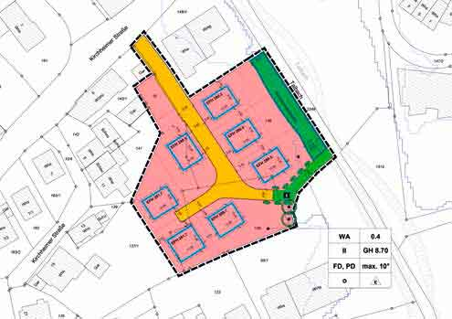

\page Thema03_8md TOP 3: Talbachgasse

Für das relativ kleine Gebiet „Talbachgasse“ hinter dem neuen Cafele
bei der Brücke in der Kirchheimer Straße hat der Gemeinderat noch im
Dezember 2018 den Bebauungsplan beschlossen. Die Erschließungsarbeiten
folgen im Frühjahr/Sommer 2019. Dort können insgesamt
7 Ein- bzw. Zweifamilienhäuser erstellt werden. Im Rahmen des Genehmigungsverfahrens
fanden in diesem Gebiet archäologische Grabungen
statt. Interessante Funde lassen darauf schließen, dass vor einigen
Jahrhunderten hier bereits eine kleine Siedlung bestand. Sollten
im Laufe der kommenden Bauarbeiten weitere Funde zu Tage treten,
haben wir angeregt, dass diese in einer Dauerausstellung in Hochdorf
verbleiben können.

