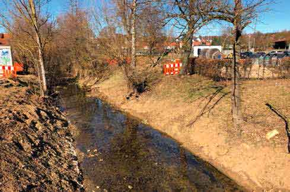

\page Thema4 TOP 4: Talbachsanierung

Zu normalen Zeiten dümpelt der Talbach im Ortskern so vor sich hin.
Ihn zugänglicher und ansehnlicher umzugestalten, ist schon lange ein
Wunsch vieler Bürger. Erste Planungen dazu wurden schon Ende 2017
im Gemeinderat vorgestellt – seither herrscht Ruhepause. Wir werden
uns verstärkt dafür einsetzen, ihn endlich erlebbarer zu machen insbesondere
auch im Hinblick auf die anstehenden und an den Talbach angrenzenden
Baumaßnahmen „Talbachgasse“ und „Breitwiesenareal“.

