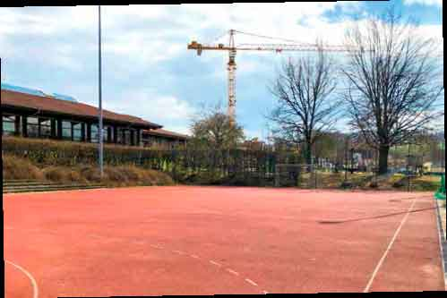

\page Thema07_8md TOP 7: Lebens- und Wohnqualität, Infrastruktur

Um sich in Hochdorf wohl zu fühlen, erwarten Alt- und Neubürger jeweils mit ihren Familien eine hervorragende
Lebens- und Wohnqualität, eine gute Verkehrsanbindung und einen hohen Freizeitwert.
Diese Kriterien erfüllt die Gemeinde im Wesentlichen in vollem Umfang, wozu auch die verschiedensten
Angebote der Kirchen, Vereine und sonstiger Organisationen beitragen. Dazu bedarf es aber auch
einer intakten Infrastruktur für nahezu alle Belange unserer Einwohner. Diese Infrastruktur laufend zu
unterhalten und bei einer Zunahme der Einwohner wie geplant dann anzupassen, gehört mit zu den
Hauptaufgaben der Gemeinde.

