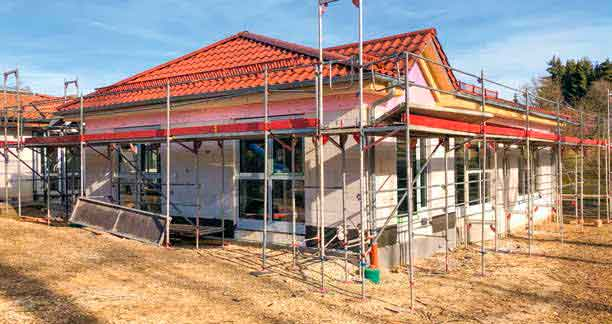
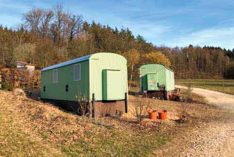

\page Thema08_8md TOP 8: Kleinkindbetreuung

Sowohl das evangelische Kinderhaus am Talbach als auch das katholische Albert-Schweitzer-
Kinderhaus bieten in jeweils mehreren Gruppen den Regelbetrieb für Kinder ab 3 Jahren
an. Darüber hinaus verfügt das ASK auch über eine Kinderkrippe. Hinzu kommt der evangelische
Waldkindergarten. Um der gestiegenen Nachfrage entsprechen zu können, eröffnet
ab Herbst 2019 das neue Kinderhaus Im Hof, betrieben von der Gemeinde als Kinderkrippe
und Regelkindergarten. Die von der Gemeinde überwiegend zu tragenden Betriebskosten
für alle Einrichtungen sind einer der größten Kostenblöcke im Ergebnishaushalt und belegen
deren Wichtigkeit.

