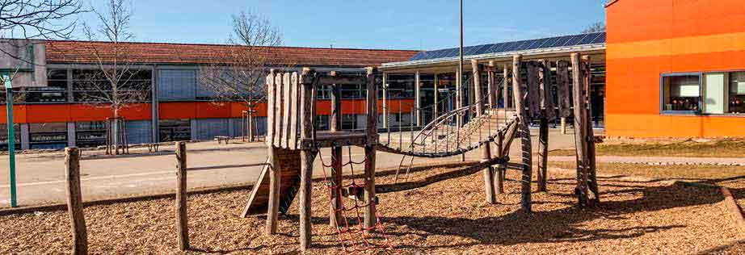

\page Thema09_8md TOP 9: Schule und Schulkindbetreuung

Während andernorts immer mehr Grundschulen zu Ganztagesschulen entweder in Wahl- oder
gebundener Form umgewandelt worden sind, war dies bisher in Hochdorf auch unter Einbeziehung
der Schulkindbetreuung noch nicht möglich. Wir bedauern diese Entwicklung sehr, sind sich
doch sämtliche Fachleute darüber einig, dass eine Ganztagesschule aus pädagogischer Sicht die
wertvollste Schulform ist, die wir unseren Kindern angedeihen lassen können. Deshalb werden wir
aktiv daran mitarbeiten und sämtliche Schritte unterstützen, die zu einem positiven Meinungsumschwung
und zu größtmöglichen Einvernehmen aller Beteiligten führen können.

