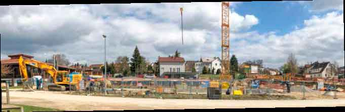

\page Thema10 TOP 10: Einrichtung für Senioren

Nach vielen Jahren des Verhandelns und Wartens bekommt Hochdorf mit der Amalien-Residenz
eine feste Einrichtung für Senioren. Die Evangelische Heimstiftung erstellt und betreibt
dann auch im Breitwiesenareal eine moderne Alternative zu einem klassischen Pflegeheim.
Das Konzept Wohnen-PLUS umfasst Pflegewohnen, Ambulante Betreute Wohngemeinschaft,
Tagespflege sowie Leistungen der Mobilen Dienste. Ferner entsteht in diesem Gebäude eine
Mensa für unsere Schulkinder, deren anteilige Kosten selbstverständlich die Gemeinde zu
tragen hat. Wir begrüßen diese Entwicklung sehr. Mit den Bauarbeiten wurde zwischenzeitlich
begonnen. Betriebsbeginn dürfte wohl um die Jahreswende 2020/2021 liegen.

