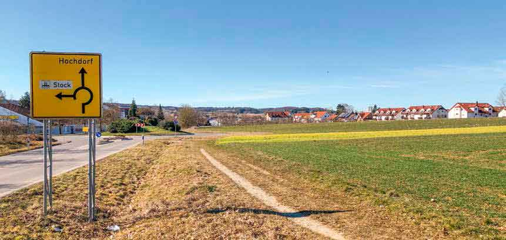

\page Thema11 TOP 11: Einkaufsmöglichkeiten

Eine Gemeinde in der Größe Hochdorfs braucht Möglichkeiten für den Einkauf von Waren
für den täglichen Bedarf. Wie schon erwähnt, ist im „Mittleren Feld“ die Verlagerung und
Vergrößerung des Edeka-Marktes in das neue Baugebiet (gegenüber Kreisverkehr) geplant.
Im Breitwiesenareal ist die Gemeinde auf der Suche nach einem Investor für ein Gebäude, in
welchem als Ergänzung zu den sonstigen Einkaufsmöglichkeiten im Ort auch weitere kleinere
Geschäfte, aber auch Büros o.Ä. untergebracht werden könnten.

