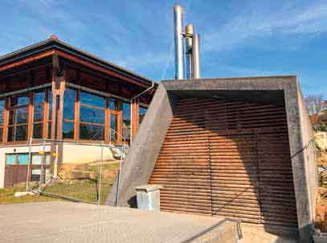

\page Thema12_8md TOP 12: Ortsstraßen und Gemeindeeinrichtungen

Nach einem Grundsatzbeschluss des Gemeinderats soll nach Möglichkeit in jedem Jahr mindestens
eine Ortsstraße einschl. der damit zusammenhängenden Tiefbauarbeiten saniert
werden. Wir werden darauf drängen, dass dies künftig auch entsprechend erfolgt, nachdem
dies in den letzten Jahren aus verschiedenen Gründen nicht immer regelmäßig vorgenommen
wurde. Die Bedarfsliste dafür ist allerdings lang, kann aber nur schrittweise umgesetzt
werden. Gleiches gilt für die laufende Unterhaltung der verschiedenen Gemeindegebäude
und Einrichtungen. Wie jeder vernünftige Hauseigentümer hat auch die Gemeinde Vorsorge
zu treffen, dass Instandsetzungsarbeiten laufend durchgeführt werden und dabei auch sämtliche
Möglichkeiten der Nachhaltigkeit wie z.B. bei der Stromversorgung, der Wärmegewinnung
usw. beachtet werden.

